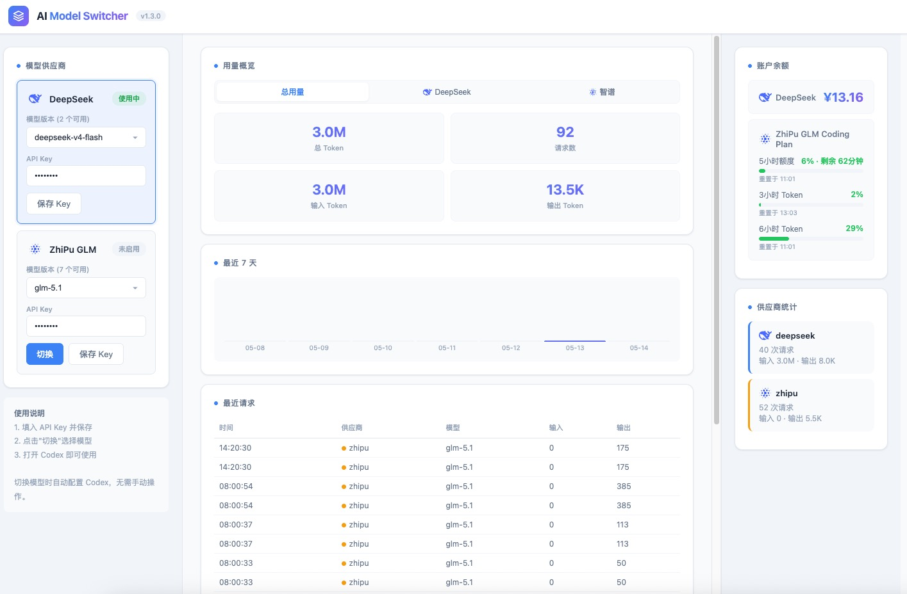

# AI Model Switcher

让 Codex CLI / Desktop 无缝使用 DeepSeek、智谱 GLM 等模型。

Codex 使用 OpenAI Responses API 协议，而 DeepSeek 只提供 Chat Completions API，智谱 GLM 提供 Anthropic Messages API。本项目在本地启动一个统一代理，自动翻译协议，支持一键切换模型。

## 截图



## 架构

```
客户端 ──Responses API──▶ AI Model Switcher :11435 ─┬─ Chat API ──▶ api.deepseek.com
                                                      └─ Anthropic ──▶ open.bigmodel.cn
```

## 特性

- **协议翻译**：Responses API ↔ Chat Completions / Anthropic Messages 双向转换
- **多模型支持**：DeepSeek、智谱 GLM，可扩展更多
- **Web 管理界面**：三栏布局，浏览器中切换模型、查看余额和用量统计
- **自动配置 Codex**：切换模型或保存 API Key 时自动写入 Codex 配置，无需手动编辑
- **账户余额**：实时显示各供应商账户余额（DeepSeek 余额、智谱 Coding Plan 配额）
- **用量统计**：Token 消耗追踪、按供应商筛选、7 天趋势图、请求历史
- **工具调用**：完整支持 function calling，连贯执行不中断
- **服务控制**：Web 面板一键暂停/恢复/重启服务
- **后台运行**：关闭终端服务不停，开机自动启动
- **跨平台**：支持 macOS 和 Windows
- **流式输出**：SSE 实时翻译，体验与原生一致

## 前置条件

- Node.js >= 18（一键安装脚本会自动检测）
- 至少一个模型的 API Key

## 快速安装

### Windows

**方式一：一键安装（推荐）**

1. 安装 [Node.js](https://nodejs.org) LTS 版本
2. 克隆或下载本项目：
   ```bash
   git clone https://github.com/chaibaoqing/ai-model-switcher.git
   cd ai-model-switcher
   ```
3. 双击 `install.bat`，按提示操作，完成后自动打开管理界面

**方式二：手动安装**

```bash
git clone https://github.com/chaibaoqing/ai-model-switcher.git
cd ai-model-switcher
npm install
copy config.example.json config.json
# 编辑 config.json 填入 API Key
npm start
```

### macOS

**方式一：一键安装（推荐）**

```bash
git clone https://github.com/chaibaoqing/ai-model-switcher.git
cd ai-model-switcher
chmod +x install.sh
./install.sh
```

**方式二：手动安装**

```bash
git clone https://github.com/chaibaoqing/ai-model-switcher.git
cd ai-model-switcher
npm install
cp config.example.json config.json
# 编辑 config.json 填入 API Key
npm start
```

### 没有 Git？

去 [GitHub 页面](https://github.com/chaibaoqing/ai-model-switcher) 点 **Code → Download ZIP**，解压后进入目录。

## 获取 API Key

| 供应商 | 申请地址 | 说明 |
|--------|----------|------|
| DeepSeek | https://platform.deepseek.com/api_keys | 注册后在 API Keys 页面创建 |
| 智谱 GLM | https://open.bigmodel.cn/usercenter/apikeys | 注册后在 API Keys 页面创建 |

## 服务管理命令

```bash
# 前台启动（可看日志，关闭终端服务停止）
npm start

# 后台启动（关闭终端服务不停）
npm run start:bg

# 停止后台服务
npm run stop

# 安装开机自启服务
node scripts/install-service.js

# 卸载开机自启服务
node scripts/uninstall-service.js
```

也可以在 Web 管理界面顶部操作暂停、恢复、重启服务。

## 配置

编辑 `config.json`：

```json
{
  "activeProvider": "deepseek",
  "mainPort": 11435,
  "providers": {
    "deepseek": {
      "name": "DeepSeek",
      "apiKey": "你的DeepSeek API Key",
      "baseUrl": "https://api.deepseek.com",
      "model": "deepseek-v4-flash",
      "wireApi": "chat",
      "port": 21435
    },
    "zhipu": {
      "name": "ZhiPu GLM",
      "apiKey": "你的智谱 API Key",
      "baseUrl": "https://open.bigmodel.cn/api/anthropic/v1/messages",
      "model": "glm-5.1",
      "wireApi": "anthropic",
      "port": 21436
    }
  }
}
```

也可以启动后在 Web 管理界面在线配置，**切换模型或保存 API Key 时会自动写入 Codex 配置，无需手动编辑任何文件**。

## Web 管理界面

启动后自动打开 http://127.0.0.1:11435/admin

- **顶栏**：服务状态、暂停/恢复/重启按钮
- **左栏**：模型供应商管理，切换模型、配置 API Key
- **中栏**：用量概览（总用量 / DeepSeek / 智谱）、7 天趋势图、最近请求记录
- **右栏**：账户余额、各供应商详细统计

## 支持的模型

| 供应商 | 模型 | API 协议 | 特点 |
|--------|------|----------|------|
| DeepSeek | deepseek-v4-flash | Chat Completions | 高性价比 |
| DeepSeek | deepseek-v4-pro | Chat Completions | 更强推理 |
| 智谱 | glm-5.1 | Anthropic Messages | 套餐量大 |

## 添加新供应商

编辑 `config.json`，在 `providers` 下添加新条目：

```json
{
  "name": "My Provider",
  "apiKey": "your-key",
  "baseUrl": "https://api.example.com",
  "model": "model-name",
  "wireApi": "chat",
  "port": 11437
}
```

支持的 `wireApi` 值：
- `chat` — OpenAI Chat Completions API
- `anthropic` — Anthropic Messages API

## 更新日志

### v1.3.0
- 服务控制：Web 面板支持暂停/恢复/重启
- 自动配置 Codex：切换模型或保存 Key 时自动写入，无需手动编辑
- 启动时自动打开浏览器
- 后台运行模式：`npm run start:bg`，`npm run stop` 停止
- 重启修复：独立脚本杀旧进程再启新进程，避免端口冲突
- 修复 Windows 下浏览器无法自动打开的问题

### v1.2.0
- 项目重命名为 AI Model Switcher
- 跨平台支持：macOS + Windows
- 平台抽象层：`scripts/platform/` 按系统分发
- Windows 一键安装 `install.bat`
- macOS 一键安装 `install.sh`
- Web 管理界面三栏布局，浅色科技风格
- 用量统计按供应商筛选（总用量/DeepSeek/智谱）
- 供应商 Logo（LobeHub SVG）
- 模型版本自动获取
- 账户余额和 Coding Plan 配额显示

### v1.1.0
- 用量统计追踪
- Web 管理界面
- 余额查询

### v1.0.0
- 初始版本
- Responses API ↔ Chat Completions / Anthropic Messages 协议翻译
- DeepSeek 和智谱 GLM 双供应商支持
- SSE 流式输出

## License

MIT
